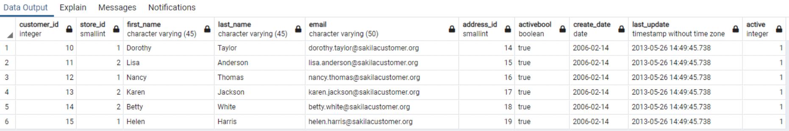
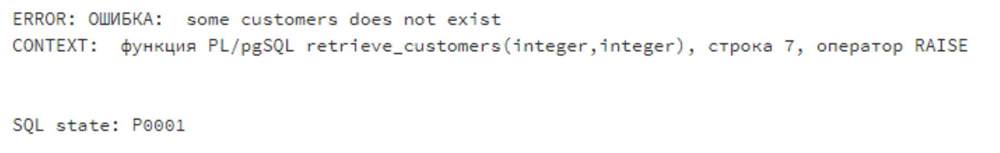

# Lab 9

## Task 1
```python
import psycopg2
from geopy.geocoders import Nominatim

conn = psycopg2.connect(
    host="localhost",
    database="dvdrental",
    user="postgres",
    password="123456",
    port="5433"
)

cur = conn.cursor()
cur.execute("alter table address add latitude float")
cur.execute("alter table address add longtitude float")
cur.execute("select * from address where address.address like '%11%' and address.city_id > 399 and address.city_id < 601")
new = []
geolocator =  Nominatim(user_agent="postgres")

res = cur.fetchall()

for i in res:
    addr = []
    addr.append(i[1])
    try:
        loc = geolocator.geocode(i[1])
        addr.append(loc.latitude)
        addr.append(loc.longtitude)
    except:
        addr.append(0)
        addr.append(0)
    new.append(addr)

    cur.execute("update address set latitude = "+str(new[-1][1])+"where address = '" + str(new[-1][0])+"';")
    cur.execute("update address set longtitude = " + str(new[-1][2]) + "where address = '" + str(new[-1][0]) + "';")
    print("update address set latitude = "+str(new[-1][1])+"where address = '" + str(new[-1][0])+"';")
    print("update address set longtitude = "+str(new[-1][2])+"where address = '" + str(new[-1][0])+"';")

conn.commit()
conn.close()
```

```sql
create or replace function ex1 ()
returns table (address varchar(50), address_id int)
language plpgsql
as $$
begin
 return query
 select address.address, address.address_id 
 from address
 where address.address like '%11%' and address.city_id > 399 and address.city_id < 601;
end;
$$
```

## Task 2

```sql
create or replace function retrieve_customers(start_id int, end_id int)
returns table (
	customer int,
	address int
)
as $$
begin
    if start_id <= 0 or end_id <= 0 or start_id > = end_id or end_id >= 600 then
        raise notice 'the start index(%) or end index(%) is out of bonds', start_id, end_id;
    end if;

	return query
	select c.customer_id, c.address_id
	from customer as c
	where c.address_id not in (select c2.address_id
							  from customer as c2
							  order by c2.address_id
							  limit (start_id))
	order by c.address_id
	limit (end_id);
end;
$$
language plpgsql;
```
### Tests
```sql
SELECT * FROM retrieve_customers(10, 15);
```

___
```sql
SELECT * FROM retrieve_customers(-10, 15);
```


