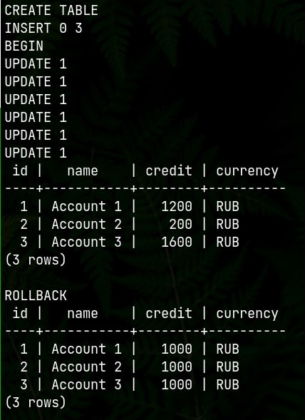
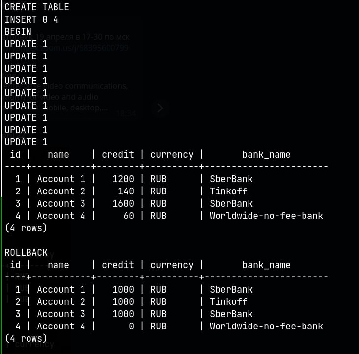
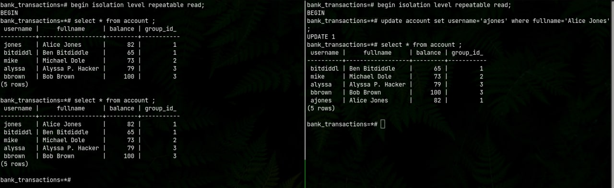
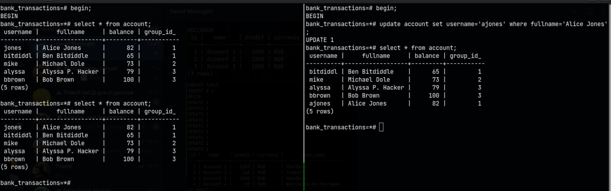
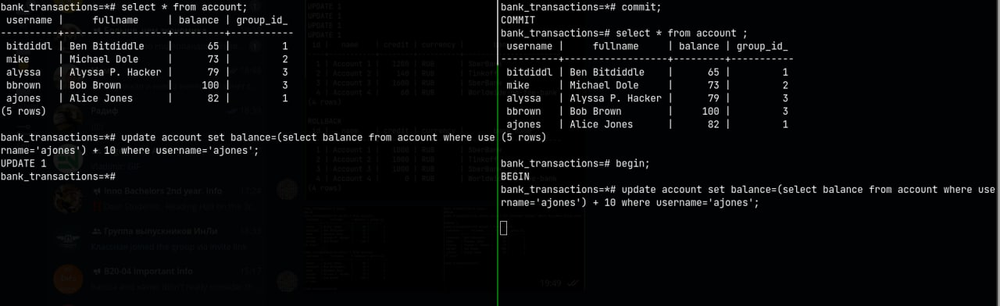
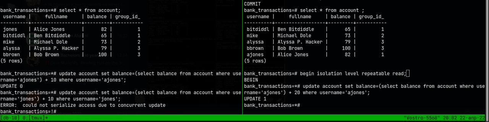
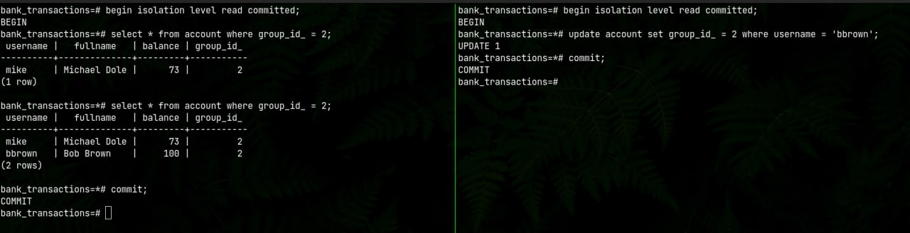
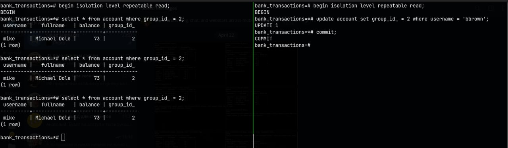

# Lab 10

# Task 1

[ex01.sql](./ex01.sql)

# Task 2

[ex02.sql](./ex02.sql)

# Task 3

[ex03.sql](./ex03.sql)

# Task 4.1

[ex04_prepopulate.sql](./ex04_prepopulate.sql)

1st output: No since the fact we didn't commit the second transactions. Read committed protects from dirty read

2nd output: Lock. Why? We changed rows in the first transaction, and the UPDATE in the second transaction waits until
this changes will be committed (just SELECT will not see any changes here).

# Task 4.2

1st output: No since the fact we didn't commit the second transactions. Read committed protects from dirty read

2nd output: REPEATABLE READ prevents from getting the same result set (I mean rows) but with different data inside of
it (Non repeatable read). So the first transaction would work with modified data, which is prohibited at this isolation
level. I suppose, if we would use snapshots at the start of the transaction, we would leave ACID durability principle (
We would just lose changes after commit both transactions).

